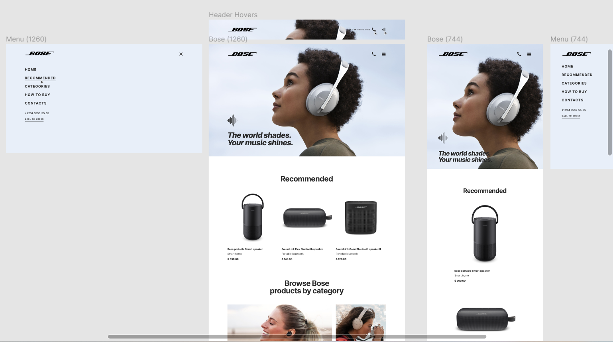

# Bose - a HTML and CSS based landing page, fit for a company/service with a one page view.

## [Check the live demo here](https://alina-kabanets.github.io/bose-landing-page/)

### Features:

- Responsive Landing Page Using HTML, CSS & JavaScript, Scss and BEM methodology.
- The project was implemented from the [Figma design](https://www.figma.com/file/OMjQNb3hg1LKMV4OwyQ3Ao/BOSE?node-id=0%3A1&t=tfAdrWUpxrkXjou7-0)
- Developed first with the Mobile First methodology, then for desktop and tablet.
- Responsive gallery images.
- Smooth scrolling for the whole page.
- Fixed header navigation menu with hover transition on the icons.
- Sections designed with flexbox or CSS grid.
- Location-related addresses / links open google maps.
- Section buttons designed with hover transition.
- Placeholders in the forms suggest what to enter; require validation of the form fields (required, email / tel etc.), then it is clear in what format to enter the data.

![preview img]/src/images/photos/preview.png)

