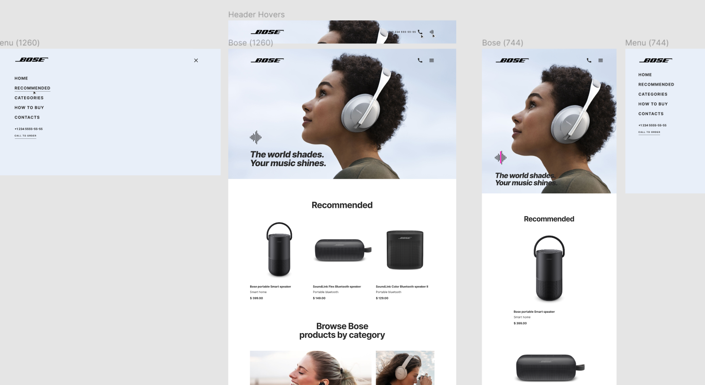

---

## **BOSE landing page**

_ BOSE is a responsive landing page for a company/service using HTML and CSS, based on a Figma design. The landing page follows a Mobile First approach, ensuring optimal user experience across devices, including mobile, tablet, and desktop. The project features a modern design with smooth scrolling, interactive elements, and a fixed header for easy navigation._

## **Demo**

🔗 [**Live Preview**](https://alina-kabanets.github.io/bose-landing-page/)


## **Design Reference **

🖼 [**Figma Mockup**](https://www.figma.com/file/OMjQNb3hg1LKMV4OwyQ3Ao/BOSE?node-id=0%3A1&t=tfAdrWUpxrkXjou7-0)


## **🛠️ Technologies Used**

- **HTML5: Structured the content and layout of the landing page.**
- **CSS3 / SCSS: Styled the landing page, utilizing CSS Grid and Flexbox for layout, as well as transitions and animations for interactive elements.**
- **JavaScript (ES6+): Dynamic interaction.**
- **GitHub Pages: Deployed and hosted for easy access and testing.**


## 🚀 **Features**


- 🔥 Mobile First Development: Started with a mobile-optimized layout, progressively enhancing the design for larger screens.

- ⚡ Smooth Scrolling: Enabled smooth scrolling for a seamless navigation experience across the page.

- ✨ Fixed Header Navigation: Designed a fixed header that remains visible as users scroll, with hover effects for interactive feedback.

- 📌 Responsive Gallery: Created a responsive image gallery that adapts to screen sizes, maintaining image quality and layout integrity.

- 🔥 Form Functionality: Added form placeholders and validation to ensure user input accuracy, with focus on usability and accessibility.

- ✨ Interactive Buttons: Designed buttons with hover effects to enhance user interaction and provide a modern look and feel.


## 📸 **Screenshots**





## 🤝 **Contributing**

Contributions, issues, and feature requests are welcome! Feel free to open a pull request or submit feedback.

## 📧 **Contact**

If you have any questions or suggestions, feel free to reach out:

LinkedIn: https://www.linkedin.com/in/alina-kabanets/

GitHub: https://github.com/alina-kabanets

---


## 📦 **Getting Started**

Follow these steps to set up the project locally

### 1\. **Clone the repo**

```bash
git clone https://github.com/alina-kabanets/bose-landing-page
cd project-name
```

### 2\. **Install dependencies**

```bash
npm install
# or
yarn install
```

### **3\. Run the project locally**

```powershell
npm start
# or
yarn start
```

---
